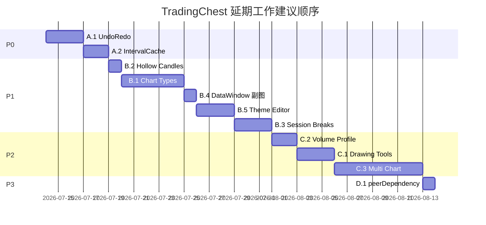

# TradingChest 延期工作汇总计划

> **For agentic workers:** REQUIRED SUB-SKILL: Use superpowers:subagent-driven-development (recommended) or superpowers:executing-plans to implement this plan task-by-task. Steps use checkbox (`- [ ]`) syntax for tracking.
>
> **本计划性质:** 汇总文档，非单一功能实施计划。各 Phase 可拆分为独立子计划后执行。

**Goal:** 将先前各计划中未完成、已取消或明确超出范围的工作项汇总为统一 backlog，按优先级排列，便于后续逐项立项实施。

**Architecture:** 按 P0→P3 四级优先级组织；每项标注来源计划、当前状态与依赖关系。已完成项仅作交叉引用，不纳入实施范围。

**Tech Stack:** KLineChart 9.x, Solid.js 1.6, TypeScript 6, Vitest 4, Vite 8

**汇总来源:**

| 来源文档 | 状态 |
|----------|------|
| [`2026-03-23-quality-and-capability-upgrade.md`](2026-03-23-quality-and-capability-upgrade.md) | ✅ 主体完成；Phase 7–10 为后续阶段 |
| [`2026-03-18-tradingview-parity.md`](2026-03-18-tradingview-parity.md) | 🟡 部分完成；Phase 1/5 有遗留 |
| [`2026-03-23-fix-critical-bugs.md`](2026-03-23-fix-critical-bugs.md) | ✅ 全部完成 |
| [`2026-03-23-fix-quality-perf.md`](2026-03-23-fix-quality-perf.md) | ✅ 全部完成 |
| [`2026-03-23-indicator-lazy-loading.md`](2026-03-23-indicator-lazy-loading.md) | ✅ 全部完成 |
| [`2026-03-23-bar-replay.md`](2026-03-23-bar-replay.md) | ✅ 全部完成 |
| [`specs/2026-03-23-deep-audit-fix-design.md`](../specs/2026-03-23-deep-audit-fix-design.md) | ✅ 三分支完成；Remaining Gaps 待处理 |
| [`specs/2026-03-18-tradingview-parity-design.md`](../specs/2026-03-18-tradingview-parity-design.md) | 🟡 总体进度 75–90% |
| [`specs/2026-07-10-ux-enhancement-design.md`](../specs/2026-07-10-ux-enhancement-design.md) | ✅ 主体完成；Known Limitations 待跟进 |

---

## 已完成项（不再纳入本 backlog）

以下工作已在独立计划中完成，此处仅作记录以免重复立项：

| 功能 | 完成计划 / 规格 |
|------|----------------|
| Vitest 测试基础设施 + 核心模块单测 | quality-and-capability-upgrade Phase 1 |
| globalThis / 内存泄漏 / dispose() | quality-and-capability-upgrade Phase 2 + fix-critical-bugs |
| ReconnectingWebSocket + DefaultDatafeed 加固 | quality-and-capability-upgrade Phase 3/6 |
| 报警系统 AlertManager + AlertLine | quality-and-capability-upgrade Phase 4 |
| 多品种对比 Compare API | quality-and-capability-upgrade Phase 5 |
| lodash 移除 + 渲染性能优化 | fix-quality-perf |
| 指标懒加载 IndicatorRegistry + incrementalCalc | indicator-lazy-loading |
| K 线回放 ReplayEngine + ReplayControlBar | bar-replay |
| 80+ 技术指标 | indicator-expansion-design (2026-07-10) |
| 45+ 绘图工具 | tradingview-parity Phase 2–3 |
| 右键菜单 / 数据窗口 / 收藏 / 搜索框 UX | ux-enhancement-design (2026-07-10) |
| CSV 导出 + 截图 + 布局持久化 | tradingview-parity Phase 5–6 |

---

## Phase A: P0 — 核心功能缺口

### A.1 撤销/重做系统（UndoRedoManager 重建）

**来源:** fix-quality-perf Task 2（已删除 dead code）、tradingview-parity-design Phase 4/5、deep-audit Remaining Gaps #1

**现状:** `src/shortcut/undoRedo.ts` 已删除；`chart:undo` / `chart:redo` 快捷键绑定已移除。Ctrl+Z / Ctrl+Shift+Z 无功能。

**目标:** 基于 Command Pattern 重新设计，覆盖：
- 绘图 overlay 创建/删除/属性修改
- 指标添加/移除（可选，二期）

**建议文件:**
- Create: `src/shortcut/undoRedo.ts` — Command 接口 + UndoRedoManager
- Create: `src/shortcut/__tests__/undoRedo.test.ts`
- Modify: `src/shortcut/defaultBindings.ts` — 恢复 undo/redo 绑定
- Create: `src/shortcut/overlayCommands.ts` — OverlayCreateCommand / OverlayRemoveCommand
- Modify: `src/ChartProComponent.tsx` — 在 overlay/指标操作处 push command

**依赖:** 无

**预估:** 2–3 天

- [x] **Step 1:** 编写 UndoRedoManager 单元测试（push/undo/redo/clear/maxHistory）
- [x] **Step 2:** 实现 Command 接口与 UndoRedoManager
- [x] **Step 3:** 集成 overlay 创建/删除 command
- [x] **Step 4:** 恢复快捷键绑定并验证
- [x] **Step 5:** 全量测试 + 构建

---

### A.2 Datafeed 层区间缓存（DataCache 重新设计）

**来源:** quality-and-capability-upgrade Task 3.2（已取消删除）、deep-audit Remaining Gaps #2、fix-quality-perf NOTE

**现状:** 原 `DataCache` 按 symbol+period 整段缓存，未集成到 `DefaultDatafeed`，与 `getHistoryKLineData(from, to)` 区间查询语义不匹配，已于 2026-07-11 删除。

**目标:** 按 `(symbol, period, from, to)` 区间缓存历史 K 线，减少重复 API 请求；支持区间合并与 LRU 淘汰。

**建议文件:**
- Create: `src/datafeed/IntervalCache.ts`
- Create: `src/datafeed/__tests__/IntervalCache.test.ts`
- Modify: `src/DefaultDatafeed.ts` — 在 `getHistoryKLineData` 中读写缓存

**设计要点:**
- 缓存 key: `${ticker}:${period}:${resolution}`
- 存储已获取的时间区间列表 + 数据
- 请求前先查缓存，命中则返回子集；未命中则请求并合并
- 不与 klinecharts 内部 `dataList` 重复职责——仅减少网络层调用

**依赖:** 无

**预估:** 1–2 天

- [ ] **Step 1:** 编写 IntervalCache 测试（区间合并、LRU 淘汰、部分命中）
- [ ] **Step 2:** 实现 IntervalCache
- [ ] **Step 3:** 集成到 DefaultDatafeed.getHistoryKLineData
- [ ] **Step 4:** 全量测试 + 构建

---

## Phase B: P1 — 图表能力与 UI 完善

### B.1 新图表类型（Renko / Kagi / P&F / Line Break / Range Bars）

**来源:** tradingview-parity-design Phase 1、deep-audit Remaining Gaps #3

**现状:** 已有 8 种（candle 变体、ohlc、area、heikinAshi、baseline）。缺 5 种时间无关或价格驱动类型。

**目标:** 通过 `registerIndicator` 数据转换 + 自定义渲染，逐个实现：

| 类型 | 文件 | 复杂度 |
|------|------|--------|
| Renko | `src/chartType/renko.ts` | 中 |
| Kagi | `src/chartType/kagi.ts` | 中 |
| Point & Figure | `src/chartType/pointAndFigure.ts` | 高 |
| Line Break | `src/chartType/lineBreak.ts` | 中 |
| Range Bars | `src/chartType/rangeBars.ts` | 中 |

**附加:**
- Modify: `src/widget/setting-modal/data.ts` — 暴露新类型选项
- Modify: `src/chartType/index.ts` — 注册并导出
- 各类型需 i18n 键（4 locale .ini）

**依赖:** 无（可逐个独立交付）

**预估:** 每个 0.5–1 天，合计 3–5 天

- [x] **Task B.1a:** Renko 图表类型 + 测试
- [x] **Task B.1b:** Kagi 图表类型 + 测试
- [x] **Task B.1c:** Point & Figure 图表类型 + 测试
- [x] **Task B.1d:** Line Break 图表类型 + 测试
- [x] **Task B.1e:** Range Bars 图表类型 + 测试
- [x] **Task B.1f:** setting-modal UI 暴露 + i18n + 构建验证

---

### B.2 Hollow Candles UI 暴露

**来源:** tradingview-parity-design Phase 1（`candle_stroke` 已存在但未在 UI 暴露）

**现状:** 引擎支持 `candle_stroke`，设置面板可能未列出。

**目标:** 在 chart type 选择中增加 Hollow Candles 选项。

**建议文件:**
- Modify: `src/widget/setting-modal/data.ts`
- Modify: `src/i18n/*.ini` — 添加 `chart_type_hollow_candles` 键

**预估:** 0.5 天

- [x] **Step 1:** 确认 `candle_stroke` 渲染正常
- [x] **Step 2:** 添加到 setting-modal 选项列表
- [x] **Step 3:** i18n + 构建验证

---

### B.3 Session Breaks（盘前盘后分隔线）

**来源:** tradingview-parity-design Phase 8、deep-audit Remaining Gaps #5

**现状:** 未实现。需要在 K 线图上绘制交易时段分隔竖线。

**目标:** 支持配置交易时段（如美股 9:30–16:00 ET），在非交易时段边界绘制分隔线。

**建议文件:**
- Create: `src/session/types.ts` — SessionConfig 接口
- Create: `src/session/sessionBreaks.ts` — 计算 break 时间点
- Create: `src/session/__tests__/sessionBreaks.test.ts`
- Modify: `src/ChartProComponent.tsx` — 通过 klinecharts 自定义 figure 或 overlay 渲染分隔线

**依赖:** 需调研 klinecharts 是否支持 session 分隔 API；若无则通过 overlay 竖线实现

**预估:** 2–3 天

- [ ] **Step 1:** 调研 klinecharts session break 支持
- [ ] **Step 2:** 编写 sessionBreaks 单元测试
- [ ] **Step 3:** 实现时段计算逻辑
- [ ] **Step 4:** 集成到 ChartProComponent 渲染
- [ ] **Step 5:** 添加配置入口（setting-modal 或 API）+ i18n

---

### B.4 数据窗口 — 副图指标值

**来源:** ux-enhancement-design §7 Known Limitations #3

**现状:** DataWindow 仅显示主图（candle_pane）指标值，副图 pane 指标未展示。

**目标:** 遍历所有 indicator pane，提取 crosshair 位置处的指标值并显示。

**建议文件:**
- Modify: `src/ChartProComponent.tsx` — 扩展 crosshair 订阅，遍历 pane
- Modify: `src/widget/data-window/index.tsx` — 支持分组显示（主图 / 副图）

**依赖:** 需确认 klinecharts `getIndicatorByPaneId` / pane 列表 API

**预估:** 1 天

- [x] **Step 1:** 调研 klinecharts pane 遍历 API
- [x] **Step 2:** 扩展 dataWindowData 信号结构（遍历所有 pane，分组显示）
- [x] **Step 3:** 更新 DataWindow UI 分组渲染
- [x] **Step 4:** 测试 + 构建

---

### B.5 主题编辑器 + 导入/导出

**来源:** tradingview-parity-design Phase 7、deep-audit Remaining Gaps #6

**现状:** 5 个内置主题（dark/light/midnight/classic/highContrast）；设置面板可改部分颜色；无可视化主题编辑器，无 JSON 导入/导出。

**目标:**
- 可视化编辑主题颜色（蜡烛、坐标轴、网格、背景等）
- 导出当前主题为 JSON 文件
- 从 JSON 文件导入自定义主题

**建议文件:**
- Create: `src/theme/editor.ts` — 主题序列化/反序列化
- Create: `src/widget/theme-editor/index.tsx` — 编辑器 UI
- Create: `src/theme/__tests__/editor.test.ts`
- Modify: `src/widget/setting-modal/index.tsx` — 添加入口

**预估:** 2–3 天

- [x] **Step 1:** 定义 ThemeSchema JSON 格式 + 测试（5 tests）
- [x] **Step 2:** 实现 exportTheme / importTheme
- [x] **Step 3:** 创建 ThemeEditor 组件 + 工具栏按钮
- [x] **Step 4:** 集成到 ChartProComponent + i18n（4 语言）
- [x] **Step 5:** 全量测试 + 构建

---

## Phase C: P2 — 扩展能力

### C.1 缺失绘图工具（3 个）

**来源:** tradingview-parity-design Phase 3

**现状:** 45+ 工具已达标，但原计划中 3 个未实现：

| 工具 | 文件 | 说明 |
|------|------|------|
| Flat Top/Bottom | `src/extension/flatTopBottom.ts` | 平顶/平底形态 |
| Disjoint Angle | `src/extension/disjointAngle.ts` | 角度工具 |
| Forecast | `src/extension/forecast.ts` | 预测区间 |

**建议文件（每个工具）:**
- Create: overlay 实现文件
- Modify: `src/extension/index.ts` — 注册
- Modify: `src/widget/drawing-bar/index.tsx` — 添加到工具栏
- Modify: `src/i18n/*.ini`

**依赖:** 无（可逐个交付）

**预估:** 每个 0.5–1 天

- [x] **Task C.1a:** Flat Top/Bottom overlay
- [x] **Task C.1b:** Disjoint Angle overlay
- [x] **Task C.1c:** Forecast overlay

---

### C.2 Volume Profile 指标

**来源:** tradingview-parity.md Task 1.6（volumeProfile 未实现）

**现状:** `src/indicator/other/` 仅有 pivotPoints、zigzag、correlationCoefficient。elderRay 已在 `src/indicator/volume/elderRay.ts` 实现（合并 bull/bear），无需 elderRayBull/Bear 拆分。

**目标:** 实现 Volume Profile 指标（价格-成交量分布 histogram）。

**建议文件:**
- Create: `src/indicator/other/volumeProfile.ts`
- Modify: `src/indicator/other/index.ts`
- Modify: `src/indicator/loaders.ts` — 添加 lazy loader
- Create: `src/indicator/__tests__/volumeProfile.test.ts`

**依赖:** 需自定义 histogram 渲染（klinecharts figures 或 overlay）

**预估:** 1–2 天

- [ ] **Step 1:** 编写 volumeProfile 测试
- [ ] **Step 2:** 实现 calc 逻辑（价格 bin + 成交量累加）
- [ ] **Step 3:** 实现 histogram 渲染
- [ ] **Step 4:** 注册 lazy loader + i18n + 构建

---

### C.3 多图表布局

**来源:** quality-and-capability-upgrade Phase 7、tradingview-parity-design Out of Scope（平台层）

**现状:** 单图表实例。无多窗格容器、十字线联动、时间轴同步。

**目标:**
- 多窗格容器组件（1×2、2×2 等布局）
- 窗格间十字线联动
- 时间轴同步滚动/缩放
- 拖拽调整窗格大小

**建议文件:**
- Create: `src/layout/MultiChartLayout.tsx`
- Create: `src/layout/types.ts`
- Create: `src/layout/__tests__/sync.test.ts`
- Modify: `src/types.ts` — 扩展 ChartPro 或新增 LayoutManager API

**依赖:** 较大 UI 工程，建议独立 spec + 子计划

**预估:** 5–7 天

- [ ] **Step 1:** 编写设计 spec（布局模型、同步协议）
- [ ] **Step 2:** 实现 MultiChartLayout 容器
- [ ] **Step 3:** 十字线联动
- [ ] **Step 4:** 时间轴同步
- [ ] **Step 5:** 拖拽调整 + i18n + 构建

---

## Phase D: P3 — 平台级 / 长期

### D.1 solid-js 迁移为 peerDependency

**来源:** deep-audit Out of Scope

**现状:** solid-js 在 dependencies 中，消费者可能遇到版本冲突。

**目标:** 将 solid-js 移至 peerDependencies，文档说明兼容版本范围。

**风险:** Breaking change，需 major version bump

**预估:** 0.5 天 + 迁移指南

- [ ] **Step 1:** 评估现有消费者影响
- [ ] **Step 2:** 修改 package.json peerDependencies
- [ ] **Step 3:** 更新 README 迁移指南
- [ ] **Step 4:** major version release

---

## 引擎限制项（暂不实施，仅记录）

以下功能因 klinecharts 引擎 API 限制，当前无法在不 fork 引擎的情况下实现：

| 功能 | 来源 | 原因 |
|------|------|------|
| 图例悬停高亮 | ux-enhancement-design §8 | 无 legend hover 回调，Canvas 渲染 |
| Overlay z-order（上移/下移） | ux-enhancement-design §6 | 无 overlay 层级 API |
| Overlay 删除 fade-out 动画 | ux-enhancement-design §3 | Canvas 渲染，CSS 无法作用于 overlay |

**跟进策略:** 若 klinecharts 上游新增相关 API，再重新评估立项。

---

## 建议实施顺序

**推荐首批（可立即开工）:**
1. **A.1 UndoRedo** — 用户可感知的功能缺口，工作量可控
2. **B.2 Hollow Candles** — 零代码渲染逻辑，仅 UI 暴露
3. **A.2 IntervalCache** — 减少 demo datafeed API 调用，提升体验

---

## 验收标准

本 backlog 全部完成后，TradingChest 应达到：

- [x] Ctrl+Z / Ctrl+Shift+Z 撤销/重做可用
- [ ] DefaultDatafeed 历史数据请求有区间缓存
- [x] 12+ 图表类型（含 Renko/Kagi/P&F/Line Break/Range Bars/Hollow Candles）
- [ ] Session Breaks 分隔线可配置
- [x] 数据窗口显示所有 pane 指标值
- [x] 主题可可视化编辑并导入/导出 JSON
- [ ] Volume Profile 指标可用
- [x] 3 个缺失绘图工具补齐（Flat Top/Bottom, Disjoint Angle, Forecast）
- [ ] 多图表布局基础能力（或明确标记为平台层外包）

---

## 拆分子计划指引

当准备实施某个 Phase 时：

1. 从本 backlog 提取对应章节
2. 按 [`writing-plans`](../skills/writing-plans) 规范展开为完整 TDD 任务（逐步代码 + 命令 + commit）
3. 保存为 `docs/superpowers/plans/YYYY-MM-DD-<feature>.md`
4. 在本文件对应项旁标注链接，避免重复立项
